**How to implement a custom spark sql streaming source, based of v2.3 ?**

Git Repo: [SparkSqlStream](https://github.com/venkatra/SparkSqlStream)

The "SparkSqlStream" is an example project meant to demonstrate as to how to implement custom spark sql structured 
streaming source. This is based of the implementation code from  
 [spark v2.3](https://github.com/apache/spark/tree/v2.3.0/sql/core/src/main/scala/org/apache/spark/sql/execution/streaming). 
 
 The existing dstream based streaming source documentation exists here 
 [Using the custom receiver in a Spark Streaming application](https://spark.apache.org/docs/latest/streaming-custom-receivers.html).
 However this implementation is not same for structured sql streaming. As of this writing; i was not able to find a clear 
 cut documentation on how to implement a source for structured streaming. The only clue/lead I had to start with was from 
 the stackoverflow :
 
 [How to create a custom streaming data source?](https://stackoverflow.com/questions/47604184/how-to-create-a-custom-streaming-data-source)
 
 This example project is my take on deciphering the working of the source [TextSocketSource](https://github.com/apache/spark/blob/v2.3.0/sql/core/src/main/scala/org/apache/spark/sql/execution/streaming/socket.scala)
 using which I have implemented the following streaming sources
 
 * __**RandomAlphaStreamSource**__ : This generates a random set of alpha numeric characters and send the same via the 
 stream. This is a stripped down to the core implementation similar to "rate source".
 * __**MeetupRSVPStreamSource**__ : This is a simple implementation of the real time stream from [Meetup RSVP](https://www.meetup.com/meetup_api/docs/2/rsvps)
 

 _Note:_ 
 * These examples are not coded to be robust for production use-cases. They also do not cover all aspects of structured
 streaming (ex: recovery ,rollback). These, if needed, should be done by the implementor. 
 * This repo will not necessarily be maintained for future releases/versions of spark. Feel free to take it and 
 explore/enhance at your own will and needs.

***

# Implementing the source

## Source : RandomAlphaStreamSource [org.apache.spark.sql.execution.streaming.RandomAlphaStreamSource]
The "RandomAlphaStreamSource" is a source which would generate a stream which contains following columns:
* timestamp : The time when the record was generated.
* value : A random alphanumeric character.

_NOTE:_ To start of ignore the fact that this class is an extension of _org.apache.spark.sql.execution.streaming.DontCareRecoveryStreamSourceBase_ 
(i just abstracted some of the basic code to this base class _DontCareRecoveryStreamSourceBase_). 

When implementing a Sql Stream source; you basically start of by extending _org.apache.spark.sql.execution.streaming.Source_ 
trait. The RandomAlphaStreamSource will be instantiated with the _SQLContext_ at run time. As an analogy, the source 
functions similar to Kafka (commit log) processing. 

The custom source would be queried, by the caller, to return message between a "start" and "end" offset. This means that 
there is no direct interaction between the caller and the stream itself. The custom source would thus have to have an 
internal buffer of message received from the stream or in other words a sort synchronized queue. messages should ideally 
be cleared from this buffer only when the "commit" method is called.

### Initialization
There is no concept of a "initialize" method in the base class; it is left upon the implementation specific. Hence we 
declare a "initialize" method and invoke it in the class.

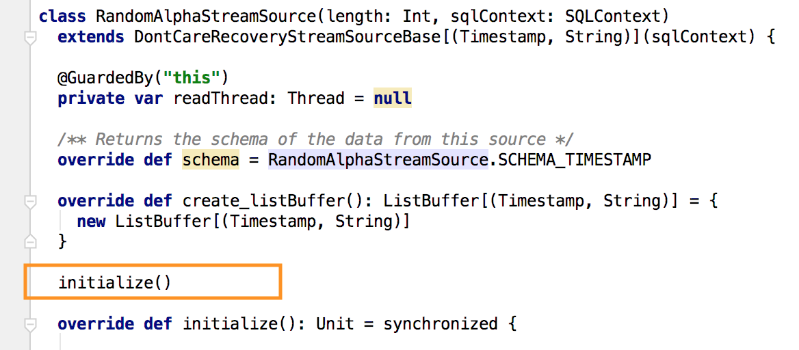

In the initialization you would want to do the following
* Connect to the actual stream (ex: socket)
* Instantiate and initialize a holding buffer.
* Instantiate a thread which will listen to the stream and populate the buffer.
* Initialize the variable where offset is kept track off.

In the "RandomAlphaStreamSource" there is no specific resource/stream to connect too, however a generator thread 
"RandomStringGenerator" is created. This thread will execute a code that will generate a record and populate the internal 
buffer. To control the speed at which messages get added to the buffer; i have put a sleep of 2ms between new record 
generation and appending to the buffer. The code also updates the offset variable "currentOffset", which keeps track of 
the offset.

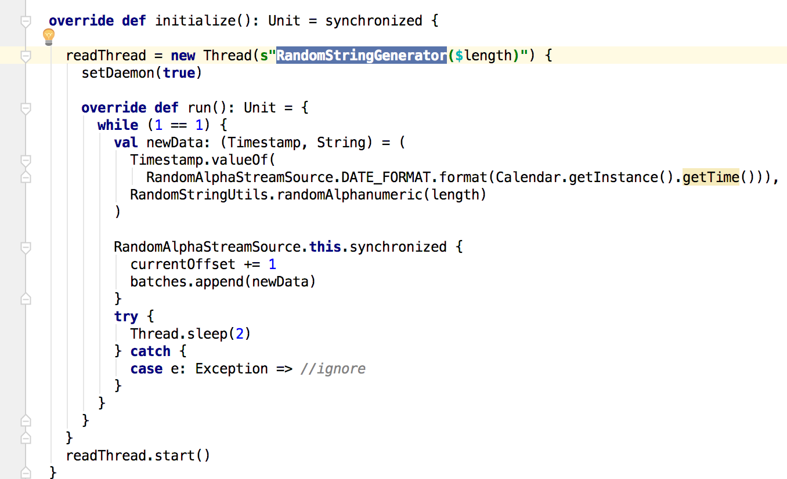

### Fetching records

The 'offset' is a pointer to a specific record in the buffer. It is incremental in nature. Though the internal buffer would
be cleared and resetted, the offset will however continue to increase. Hence it is not representative of the buffer size.

The caller would do the following type of operations when retrieving the data from the source:
* Get to know the maximum offset (method : getOffset)
* Retrieve a number of records (method : getBatch)
* commit the fact that messages upto a specific offset has been processed (method : commit)

#### Method : getBatch
Based on the passed in "start" and "end" offset; messages from the buffer are packaged up into an 'Row' returned to
the caller. For this to work the following set of code are to be observed

You get the slice of messages between the offsets into an intermediatery variable 'rawList'
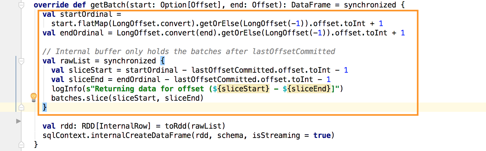

For each of the record from the list we have to form a Row; this is done using the InternalRow class.
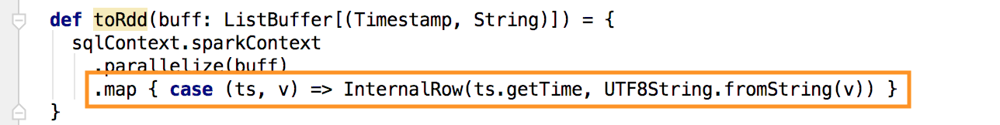

_Note:_ I had been having compiliation issues when i want to put the source code of 'RandomAlphaStreamSource' into a different
package, for example say 'ca.effpro.explore.spark.meetup'. The compiler failed as it was not able to get visibility to
the 'InternalRow' class. It is because of this reason that I had to define the class under the package 'org.apache.spark.sql.execution.streaming',
I could not figure out how they have overcome this for the Kafka sql streaming implementation.

These internal row have to be converted to a Row, which has to follow a specific schema. To declare the schema for the 
row,we would need to override the method "schema".
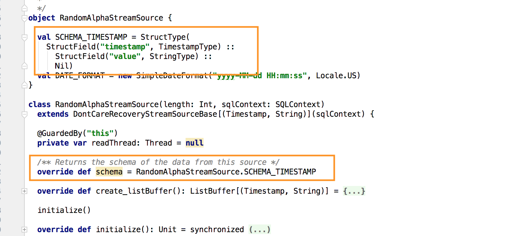 

The schema actual definition is part of the 'object' which is an instance of the source.

#### Method : commit

When the caller has successfully processed a set of messages it will pass in an offset. We use this offset to trim the records
from the buffer. This would alleviate the growing memory.
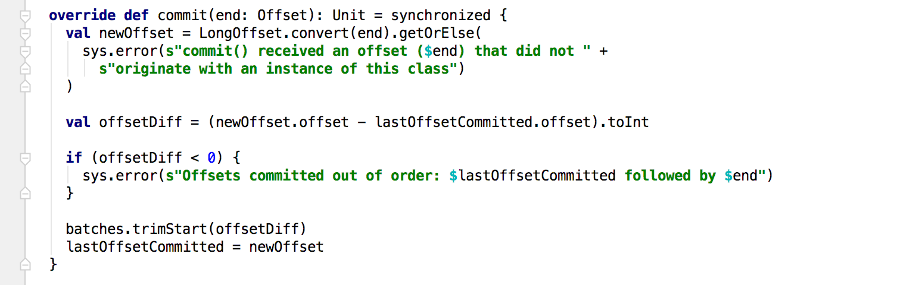

#### Method : stop

Weirdly!!! in the lack of a 'start' or 'init' method, the source has a stop method. This would get called when the stream
is stopped by the caller. you would want to do the following :
* (optionally) ensure all messages are committed
* Clear out the buffer
* Release all the resources

In the 'RandomAlphaStreamSource', there is nothing to clear hence its an empty implementation.

## Source : RandomAlphaStreamSourceProvider

The provider is the way in which the source can be registered, the finer details are beyond than what i have explored
right now and dont have the visibility yet. Hence I am going to skip on going into deep on the need for this class and will
just explain what needs to be declared.

### Method : sourceSchema

This returns a unique name for the schema of the row and the actual schema definition itself. This method is also the 
location where you can validate various parameters (optional) and mandatory parameters needed for the functioning of
the source. For example the 'len' is a parameter for the 'RandomAlphaStreamSource' which dictate the length of the generated
string.

### Method : createSource

This instantiates the source and returns an instance of the same.

### Method : shortName

This should return a string that uniquely identify a value that can be put as part of the definition of the stream.
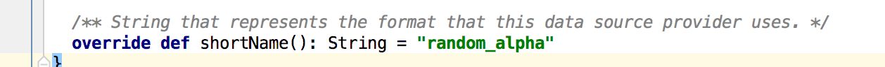

Here is the code that is used for defining the stream in the class 'ca.effpro.explore.spark.meetup.RandomAlphaStreamApp'
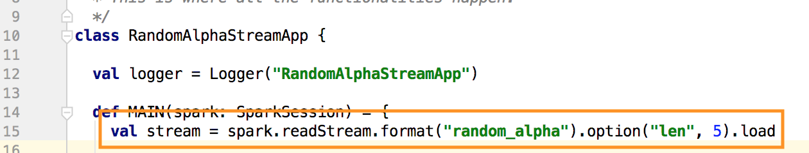

## Registration : DataSourceRegister

In order for the source provider to be recognized and instantiated; we would have define it as part of the META-INF/services.
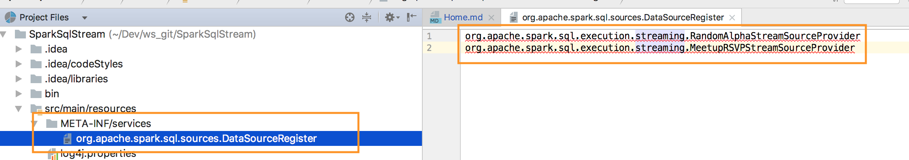

This I believe is part of the java 'serviceloader' concept of providing extensions. Would have to explore more on this myself.

## Packaging and invocation

And thats it; now you can compile, package the code. Ensure that the Meta-Inf/services are also packaged in the shaded jar.
A sample execution (a crude call) is implemented in 'ca.effpro.explore.spark.meetup.RandomAlphaStreamApp'

***

## Source : MeetupRSVPStreamSource [org.apache.spark.sql.execution.streaming.MeetupRSVPStreamSource]

The above 'RandomAlphaStreamSource' is a dummy generated source. To have a better serving purposes I have implemented
stream source that stream rsvp's of meetups. To better understand this free stream head to 
[Meetup RSVP Stream](https://www.meetup.com/meetup_api/docs/2/rsvps)

### Implementation

For most part this is not much different in implementation when compared to 'RandomAlphaStreamSource' (partly because i 
wanted to keep it light.). Essentially the logic is that, we read an http chunked stream which will send rsvp events. 
These events are stored in the memory buffer. As in the previous source based on the getbatch/commit the messages are 
forwarded to the caller and the buffer is cleared appropriately.

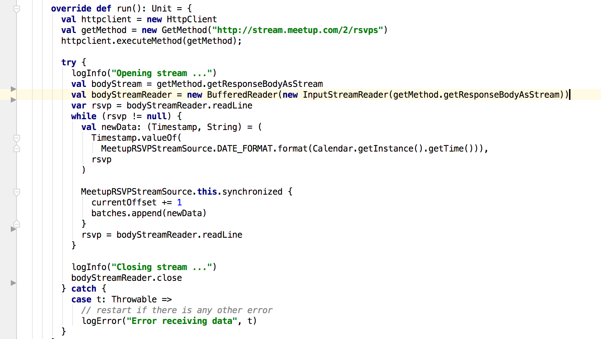

I have given the source with a short name of 'meetup_rsvp'. A crude invocation example is present in the class 
'ca.effpro.explore.spark.meetup.MeetupRSVPStreamApp'.

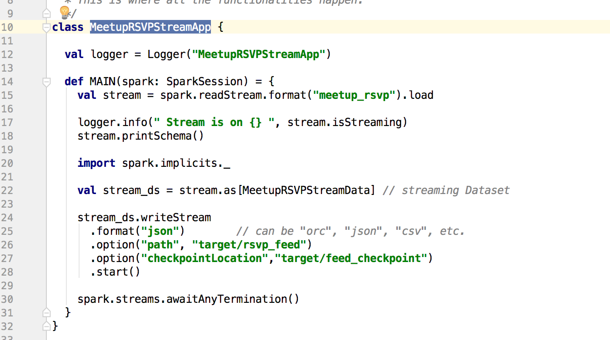

As mentioned I kept this implementation rather very light, quick and dirty. 

***

## Thoughts
As mentioned early it would have been great if there was an official documentation on implementing the custom source for
the sql streaming. Without this it was a lot of scratching and pulling effort to understand what is happening. Thanks 
'Jacek Laskowski' on putting a quick short answer in stack overflow.

Now that you have some understanding of how to implement sql streaming source; you could take this further to integrate
with other sources (ex: AMQP ,Twitter etc..) to build new sources. As mentio

If you prefer you can clone this repo and modify to your hearts content. Though a referall to this GitHub repo is appreciated.
